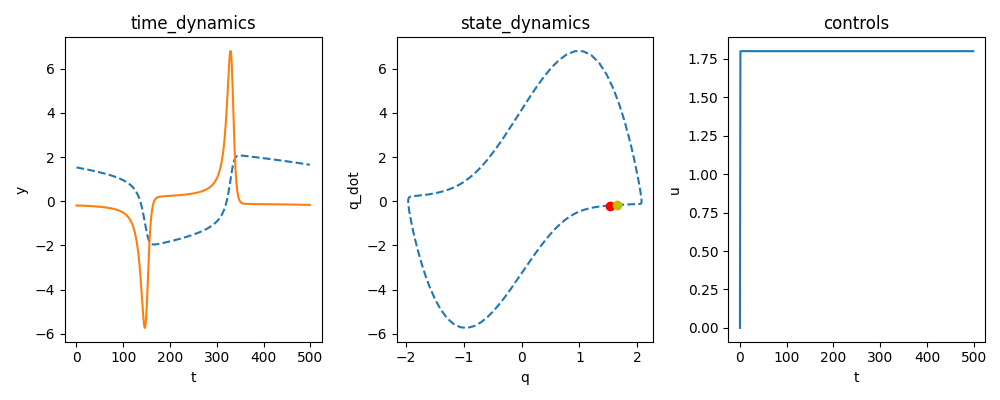

A Forced Van Der Pol Oscillator for RL

```
pip install . -r requirements.txt
```
Try to run:
```
python example.py
```
You should get something like:



Useful links:
- [wiki](https://en.wikipedia.org/wiki/Van_der_Pol_oscillator)
- [Underactuated](http://underactuated.mit.edu/simple_legs.html)
